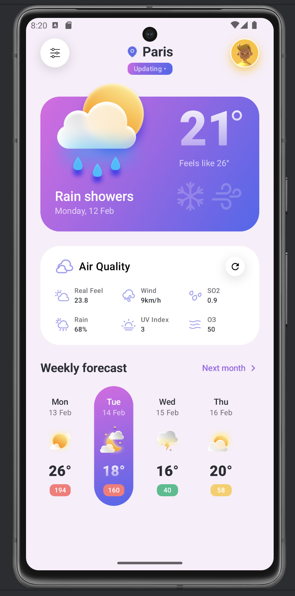

# Application Météo Mobile

Création d'une application météo pour Android en utilisant Jetpack Compose.

## 📚 Les points abordés dans ce projet

- **Comment configurer un projet Android avec Jetpack Compose et Kotlin**
- **Comment appliquer des thèmes avec Jetpack Compose**
- **Comment construire une vue Android Jetpack Compose**
- **Comment implémenter un dégradé dans Jetpack Compose**
- **Comment créer des colonnes imbriquées avec `LazyColumn` dans Jetpack Compose**
- **Comment créer une vue en grille avec Jetpack Compose**

## Technologies Utilisées
- **Langage**: Kotlin
- **Framework**: Jetpack Compose
- **IDE**: Android Studio

## Captures d'écran

Écran d'accueil montrant les prévisions météorologiques.



## Prérequis

Avant de commencer, assurez-vous d'avoir :

- Android Studio installé
- Une connaissance de base de Kotlin
- Une compréhension fondamentale de la programmation Android

## Installation et Configuration

1. **Clonez le dépôt** :
   ```bash
   git clone https://github.com/votre-utilisateur/votre-projet.git
   cd votre-projet
